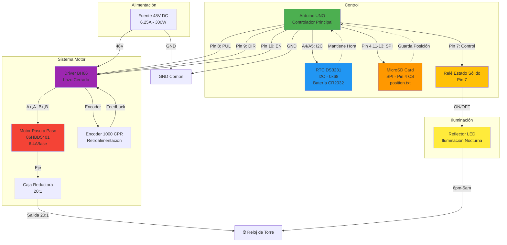

# Automatización Reloj Antiguo de Pereira

Sistema de automatización para reloj de torre histórico utilizando motor paso a paso en lazo cerrado y caja reductora planetaria de alta precisión.

## 📋 Descripción del Proyecto

Este proyecto implementa un sistema de automatización para el funcionamiento del reloj antiguo de torre, reemplazando el sistema mecánico tradicional por un sistema electromecánico controlado digitalmente. La solución garantiza precisión, confiabilidad y permite el control remoto del mecanismo.

## 🔧 Componentes Principales

### Motor Paso a Paso en Lazo Cerrado
**Modelo:** 86HBD5401-37K5Ø14EN

#### Especificaciones Eléctricas
- **Fases:** 2 fases
- **Ángulo de paso básico:** 1.8° ± 5%
- **Corriente nominal (por fase):** 6.4A
- **Resistencia (por fase) @25℃:** 0.8Ω ± 0.15Ω
- **Inductancia (por fase) @1kHz 1Vrms:** 7.3mH ± 20%
- **Torque de retención:** 12.8Nm ± 15% (113.3 lb-in)
- **Inercia del rotor:** Aprox. 4000 g·cm²
- **Peso:** Aprox. 5.6 kg

#### Especificaciones Mecánicas
- **Dimensiones:** 86mm × 86mm
- **Diámetro del eje:** Ø14mm
- **Longitud del eje:** 37mm ± 1mm

#### Encoder Integrado
- **Voltaje de entrada:** DC 5V
- **Resolución:** 1000 CPR/fase
- **Tipo de señal:** Onda cuadrada
- **Voltaje de salida:** DC 5V
- **Señales:** CHA, CHB (cuadratura)

#### Especificaciones Ambientales
- **Rango de temperatura operativa:** -20℃ ~ +50℃ (-4°F ~ 122°F)
- **Humedad relativa:** 15% RH ~ 95% RH
- **Clase de aislamiento:** B (130℃ / 266°F)
- **Elevación máxima de temperatura:** 80K
- **Resistencia dieléctrica:** 500V AC por 1 minuto
- **Resistencia de aislamiento:** 100MΩ mínimo

### Driver para Motor en Lazo Cerrado
**Modelo:** BH86

#### Características
- Control en lazo cerrado con retroalimentación por encoder
- Indicador de estado LED
- Protección contra sobrecorriente y sobrecalentamiento
- Dimensiones compactas: 150mm × 97.5mm × 50mm

#### Conexiones
- **Alimentación:** V+, V- (entrada de potencia)
- **Motor:** A+, A-, B+, B- (conexión de fases)
- **Encoder:** VCC, EGND, EA+, EA-, EB+, EB- (retroalimentación)
- **Señales de control:**
  - PUL+, PUL- (señal de pulsos/pasos)
  - DIR+, DIR- (dirección de giro)
  - EN+, EN- (habilitación del motor)
  - EX+, EX- (entrada externa)
  - ALM+, ALM- (salida de alarma)

### Caja Reductora Planetaria
**Modelo:** DLF86-L2-20-S-P2

#### Especificaciones Técnicas
- **Relación de reducción:** 20:1
- **Backlash (huelgo angular):** ≤10 arcmin
- **Eficiencia:** ≥95%
- **Torque nominal de salida:** 105 N·m
- **Torque máximo permisible:** 210 N·m
- **Velocidad nominal de entrada:** 3000 rpm
- **Velocidad máxima de entrada:** 4000 rpm
- **Nivel de ruido:** ≤60 dB
- **Clasificación de protección:** IP65 (protección contra polvo y agua)
- **Vida útil:** 20,000 horas

#### Especificaciones Mecánicas
- **Diámetro de brida:** Ø115mm
- **Diámetro de montaje:** Ø98.4mm
- **Eje de entrada:** Ø14F7 (compatible con motor)
- **Eje de salida:** Ø20h7
- **Tipo de lubricación:** Lubricación permanente
- **Fuerza radial:** 490N
- **Fuerza axial:** 460N

#### Condiciones de Operación
- **Rango de temperatura:** -15℃ ~ +80℃
- **Montaje:** 4 tornillos M5×10

#### Accesorios Incluidos
- 4 tornillos de montaje
- 1 chaveta (5×5×25mm)
- 2 tapones

### Fuente de Alimentación
**Modelo:** Fuente Conmutada 48V DC – 6.25A – 300W

#### Especificaciones
- **Voltaje de salida:** 48V DC
- **Corriente máxima:** 6.25A
- **Potencia nominal:** 300W
- **Tipo:** Fuente conmutada (Switching Power Supply)
- **Aplicación:** Alimentación del driver BH86 y motor paso a paso

#### Cálculo de Potencia Requerida
```
Potencia del motor = Corriente por fase × Voltaje × Número de fases
Potencia estimada = 6.4A × 48V × 0.7 (factor de utilización) ≈ 215W
Margen de seguridad = 300W / 215W ≈ 1.4× (adecuado)
```

### Sistema de Control

#### Arduino UNO
**Función:** Controlador principal del sistema completo

**Responsabilidades:**
- Generación de señales PUL (pulsos) para control de pasos del motor
- Control de dirección (DIR) del movimiento
- Habilitación/deshabilitación (EN) del driver
- Lectura continua del módulo RTC DS3231 para mantener la hora
- Sincronización automática del reloj físico con la hora del RTC
- Gestión de la lógica de movimiento del reloj
- Detección y recuperación ante cortes de energía
- Almacenamiento persistente de posición en tarjeta SD
- Control automático de iluminación del reloj (6pm-5am)

**Conexiones al Driver BH86:**
- Pin 8 → PUL+ (señal de pulsos)
- GND → PUL-
- Pin 9 → DIR+ (dirección)
- GND → DIR-
- Pin 10 → EN+ (habilitación)
- GND → EN-

**Conexiones al RTC DS3231:**
- SDA (A4) → SDA del DS3231
- SCL (A5) → SCL del DS3231
- 5V → VCC del DS3231
- GND → GND del DS3231

**Conexiones al Módulo MicroSD:**
- Pin 4 → CS (Chip Select)
- Pin 11 → MOSI (automático con SPI)
- Pin 12 → MISO (automático con SPI)
- Pin 13 → SCK (automático con SPI)
- 5V → VCC
- GND → GND

**Conexión Relé de Estado Sólido:**
- Pin 7 → Control del relé (reflector LED)
- GND → GND del relé

#### Módulo RTC DS3231
**Función:** Reloj de Tiempo Real de alta precisión

**Características:**
- **Precisión:** ±2 ppm (±1 minuto por año)
- **Interfaz:** I2C (dirección 0x68)
- **Voltaje de operación:** 3.3V - 5V
- **Batería de respaldo:** CR2032 (incluida)
- **Autonomía de batería:** 5-8 años típico
- **Compensación de temperatura:** Automática
- **Rango de temperatura:** -40℃ a +85℃
- **Memoria:** 32 bytes SRAM no volátil

**Ventajas del DS3231:**
- Mantiene la hora con precisión excepcional incluso sin energía externa
- No requiere cristal externo (TCXO integrado)
- Compensación automática de temperatura para máxima precisión
- Batería de respaldo garantiza continuidad del tiempo durante cortes de energía
- Interfaz I2C simple y confiable

**Lógica de Funcionamiento:**
1. El Arduino lee la hora del DS3231 cada segundo vía I2C
2. Compara la hora del RTC con la posición física del reloj
3. Calcula los pasos necesarios para mantener sincronización
4. Mueve el motor un paso por minuto para mantener el reloj actualizado
5. En caso de corte de energía, el DS3231 mantiene la hora con su batería
6. Al restaurarse la energía, el Arduino lee la hora correcta y sincroniza el reloj físico automáticamente

#### Módulo MicroSD Card Adapter
**Función:** Almacenamiento persistente de la posición del motor

**Características:**
- **Interfaz:** SPI (Serial Peripheral Interface)
- **Voltaje de operación:** 3.3V - 5V (regulador integrado)
- **Compatibilidad:** Tarjetas microSD y microSDHC
- **Velocidad:** Hasta 25 MHz en modo SPI
- **Formato:** FAT16/FAT32

**Ventajas del Almacenamiento en SD:**
- Mayor capacidad de almacenamiento vs EEPROM
- Posibilidad de registrar historial de operación
- Fácil lectura de datos mediante PC (insertar tarjeta en lector)
- Mayor durabilidad (las SD modernas soportan millones de escrituras)
- Permite guardar múltiples parámetros y configuraciones

**Funcionamiento:**
1. Cada minuto, tras actualizar la posición del motor, se guarda en archivo `position.txt`
2. El archivo contiene el número de pasos actual del motor
3. Al iniciar el sistema, se lee la última posición guardada
4. Permite recuperación exacta de posición tras cortes de energía
5. Mensajes de diagnóstico cada 30 minutos en el monitor serial

#### Sistema de Iluminación Automática
**Función:** Control de reflector LED para iluminación nocturna del reloj

**Componentes:**
- **Relé de Estado Sólido:** Control ON/OFF del reflector LED
- **Reflector LED:** Iluminación externa del reloj de torre

**Horario de Operación:**
- **Encendido automático:** 6:00 PM (18:00)
- **Apagado automático:** 5:00 AM (05:00)
- **Control manual:** Comandos LIGHT_ON / LIGHT_OFF disponibles

**Características:**
- Sincronizado con RTC DS3231 para precisión horaria
- Control automático sin intervención manual
- Posibilidad de override manual mediante comandos serial
- Estado visible en comando STATUS

## 🔌 Esquema de Conexión

### Cableado del Motor
| Cable | Color | Función |
|-------|-------|---------|
| A+    | Negro | Fase A positivo |
| A-    | Verde | Fase A negativo |
| B+    | Rojo  | Fase B positivo |
| B-    | Azul  | Fase B negativo |

### Cableado del Encoder
| Cable | Color       | Función |
|-------|-------------|---------|
| VCC   | Rojo        | Alimentación +5V |
| GND   | Negro       | Tierra |
| PA+   | Azul/Negro  | Canal A positivo |
| PA-   | Verde/Negro | Canal A negativo |
| PB+   | Azul        | Canal B positivo |
| PB-   | Verde       | Canal B negativo |

### Secuencia de Fases (Paso Completo)
Vista desde el lado de montaje:

**Sentido Horario (CW):** A+ → B+ → A- → B-  
**Sentido Antihorario (CCW):** B- → A- → B+ → A+

### Diagrama de Conexión del Sistema Completo



### Conexiones Arduino UNO ↔ Componentes

#### Arduino UNO ↔ Driver BH86
| Pin Arduino | Señal Driver | Función |
|-------------|--------------|---------|
| Pin 8       | PUL+         | Generación de pulsos |
| GND         | PUL-         | Tierra señal pulsos |
| Pin 9       | DIR+         | Control dirección |
| GND         | DIR-         | Tierra señal dirección |
| Pin 10      | EN+          | Habilitación motor |
| GND         | EN-          | Tierra señal enable |

#### Arduino UNO ↔ RTC DS3231
| Pin Arduino | Señal DS3231 | Función |
|-------------|--------------|---------|
| A4 (SDA)    | SDA          | Datos I2C |
| A5 (SCL)    | SCL          | Clock I2C |
| 5V          | VCC          | Alimentación |
| GND         | GND          | Tierra |

#### Arduino UNO ↔ Módulo MicroSD
| Pin Arduino | Señal SD     | Función |
|-------------|--------------|---------|
| Pin 4       | CS           | Chip Select |
| Pin 11      | MOSI         | Master Out Slave In (SPI) |
| Pin 12      | MISO         | Master In Slave Out (SPI) |
| Pin 13      | SCK          | Serial Clock (SPI) |
| 5V          | VCC          | Alimentación |
| GND         | GND          | Tierra |

#### Arduino UNO ↔ Relé Estado Sólido
| Pin Arduino | Señal Relé   | Función |
|-------------|--------------|---------|
| Pin 7       | Control      | Señal activación reflector |
| GND         | GND          | Tierra |

## 🛠️ Instalación

### 1. Montaje Mecánico
1. Instalar la caja reductora en el eje del reloj utilizando los 4 tornillos M5×10 incluidos
2. Montar el motor paso a paso en la brida de entrada de la caja reductora
3. Asegurar la chaveta en el eje de entrada según las especificaciones (GB1096-79)
4. Verificar el correcto alineamiento de los ejes

### 2. Conexiones Eléctricas
1. Conectar los cables del motor al driver BH86 según la tabla de cableado
2. Conectar el encoder al puerto correspondiente del driver
3. Conectar la fuente de alimentación 48V DC a V+ y V- del driver
4. Conectar Arduino UNO al driver según tabla de conexiones (pines 8, 9, 10)
5. Conectar módulo RTC DS3231 al Arduino mediante I2C (pines A4/SDA y A5/SCL)
6. Instalar batería CR2032 en el módulo DS3231 (usualmente viene incluida)
7. Conectar módulo MicroSD al Arduino mediante SPI (pin 4 CS, pines 11-13 SPI)
8. Conectar relé de estado sólido al pin 7 del Arduino para control del reflector
9. Asegurar GND común entre todos los componentes

### 3. Configuración del Driver
1. Verificar los parámetros de corriente según las especificaciones del motor (6.4A)
2. Configurar el modo de subdivisión de pasos si es necesario
3. Ajustar los parámetros de lazo cerrado para optimizar la respuesta

### 4. Programación del Arduino
1. **Instalar Librerías Necesarias:**
   - RTClib by Adafruit (para el DS3231)
   - Wire (incluida con Arduino IDE para comunicación I2C)
   - SPI (incluida con Arduino IDE para comunicación SPI)
   - SD (incluida con Arduino IDE para tarjeta SD)

2. **Preparar Tarjeta MicroSD:**
   - Formatear tarjeta en formato FAT16 o FAT32
   - La tarjeta debe estar vacía o tener espacio disponible
   - El sistema creará automáticamente el archivo `position.txt`

3. **Cargar Firmware:** [arduino_uno_control.ino](arduino_uno_control.ino)
   - Configurar pines de salida para PUL, DIR, EN, RELAY
   - Inicializar comunicación I2C con DS3231
   - Inicializar comunicación SPI con módulo SD
   - Implementar lógica de lectura continua del RTC
   - Configurar sincronización automática del reloj físico
   - Implementar detección de arranque inicial
   - Configurar sistema de almacenamiento persistente en SD
   - Implementar control automático de iluminación (6pm-5am)

### 5. Calibración Inicial
1. Insertar tarjeta MicroSD formateada en el módulo
2. Establecer la hora correcta en el DS3231 mediante el sketch de configuración
3. Posicionar manualmente las manecillas del reloj a las 12:00
4. Enviar comando `RESET` para establecer posición cero
5. Enviar comando `SYNC` para sincronizar con la hora del RTC
6. Verificar movimiento correcto del motor (debe avanzar cada minuto)
7. Confirmar que la posición se guarda en SD (revisar archivo `position.txt`)
8. Confirmar que la hora del DS3231 se mantiene tras desconectar alimentación externa
9. Verificar que el reflector LED se enciende/apaga según horario configurado

**Comandos Disponibles:**
- `SYNC` - Sincronizar reloj con hora del RTC
- `STATUS` - Mostrar estado completo del sistema
- `ENABLE` - Habilitar motor
- `DISABLE` - Deshabilitar motor
- `RESET` - Restablecer posición a 12:00
- `LIGHT_ON` - Encender reflector manualmente
- `LIGHT_OFF` - Apagar reflector manualmente

## ⚙️ Cálculos de Operación

### Velocidad de Salida
Con motor a 3000 rpm (velocidad nominal):
```
Velocidad de salida = 3000 rpm / 20 = 150 rpm
```

### Torque Disponible
**Importante:** El holding torque (12.8 N·m) es el torque estático máximo. El torque dinámico disponible durante el movimiento es menor y disminuye con la velocidad.

Torque dinámico estimado a velocidad operativa (50-70% del holding torque):
```
Torque del motor (dinámico) = 12.8 N·m × 0.6 = 7.68 N·m (aproximado)
Torque de salida = 7.68 N·m × 20 × 0.95 = 145.9 N·m
```

Torque máximo disponible en arranque (con holding torque):
```
Torque de salida (estático) = 12.8 N·m × 20 × 0.95 = 243.2 N·m
```
⚠️ **Nota:** El torque de salida estático (243.2 N·m) excede el límite de la caja reductora (210 N·m). Es necesario limitar el torque del motor mediante configuración del driver o considerar las condiciones reales de operación donde el torque dinámico será menor.

### Resolución Angular
Con encoder de 1000 CPR y reducción 20:1:
```
Resolución de salida = 1000 × 4 (cuadratura) × 20 = 80,000 pasos/revolución
Resolución angular = 360° / 80,000 = 0.0045° por paso
```

## 🔐 Características de Protección

- **IP65:** Protección completa contra polvo y chorros de agua
- **Clase de aislamiento B:** Operación segura hasta 130℃
- **Alarma integrada:** Señal ALM para detección de errores
- **Lazo cerrado:** Corrección automática de pérdida de pasos
- **Protección térmica:** Prevención de sobrecalentamiento

## 📊 Mantenimiento

### Inspección Regular
- Verificar el nivel de ruido (debe mantenerse ≤60 dB)
- Inspeccionar visualmente conexiones eléctricas
- Comprobar temperatura de operación del motor y driver

### Lubricación
- La caja reductora cuenta con lubricación permanente
- No requiere relubricación durante su vida útil de 20,000 horas

### Vida Útil Estimada
- **Caja reductora:** 20,000 horas de operación continua
- **Motor:** Según uso y condiciones ambientales
- **Driver:** Vida útil extendida con ventilación adecuada

## ⚠️ Precauciones

1. **Instalación:**
   - Asegurar correcto alineamiento de ejes para evitar cargas radiales excesivas
   - Utilizar tornillos con el torque especificado

2. **Operación:**
   - No exceder los 4000 rpm de velocidad máxima de entrada
   - Mantener temperatura ambiente dentro del rango especificado
   - No superar el torque máximo permisible de 210 N·m

3. **Eléctricas:**
   - Verificar polaridad de conexiones antes de energizar
   - Asegurar tierra adecuada en el sistema
   - Proteger cables del encoder de interferencias electromagnéticas
   - La fuente de 48V DC debe tener protección contra cortocircuitos y sobrecarga
   - Mantener conexiones seriales alejadas de cables de potencia

4. **Sistema de Control:**
   - Verificar que la batería CR2032 del DS3231 esté instalada correctamente
   - Reemplazar la batería del DS3231 cada 5-8 años o cuando se detecte pérdida de hora
   - Verificar funcionamiento del RTC antes de puesta en marcha
   - Probar la sincronización tras desconexión en ambiente controlado
   - No desconectar el DS3231 con el sistema en funcionamiento

5. **Almacenamiento en SD:**
   - Utilizar tarjetas microSD de marca confiable (SanDisk, Samsung, Kingston)
   - Formatear la tarjeta en FAT16 o FAT32 antes del primer uso
   - No remover la tarjeta SD mientras el sistema está en operación
   - Verificar periódicamente que el archivo `position.txt` se está actualizando
   - Hacer respaldo del archivo de posición antes de mantenimientos mayores
   - Reemplazar tarjeta SD cada 2-3 años como medida preventiva

6. **Sistema de Iluminación:**
   - Verificar capacidad del relé de estado sólido según potencia del reflector LED
   - Asegurar correcta conexión y aislamiento del cableado del reflector
   - El relé debe soportar la corriente del reflector con margen de seguridad
   - Verificar funcionamiento del reflector durante ciclo completo (encendido/apagado)
   - Ajustar horarios en el código si se requiere diferente programación

## 📝 Documentación Técnica

- [GearBox.pdf](GearBox.pdf) - Especificaciones de la caja reductora planetaria
- [MotorDriver.pdf](MotorDriver.pdf) - Especificaciones del motor y driver
- [arduino_uno_control.ino](arduino_uno_control/arduino_uno_control.ino) - Firmware completo con SD, RTC DS3231 y control de iluminación
- [set_rtc_time.ino](set_rtc_time/set_rtc_time.ino) - Sketch para configurar la hora inicial del DS3231
- [i2c_scanner.ino](i2c_scanner/i2c_scanner.ino) - Utilidad para detectar dispositivos I2C
- [test_motor.ino](test_motor/test_motor.ino) - Sketch de prueba del motor paso a paso

## 🏛️ Contexto Histórico

Este proyecto preserva la funcionalidad del reloj antiguo de torre de Pereira, combinando la herencia histórica con tecnología moderna para garantizar su funcionamiento preciso y confiable para las futuras generaciones.

## 📄 Licencia

Este proyecto es privado y de preservación patrimonial.

## 👤 Autor

Miguel Angel Luna Garcia - Proyecto de automatización de reloj histórico
Cristian David Alvarez Cardona - Soporte técnico y documentación

---

**Última actualización:** Enero 2026
